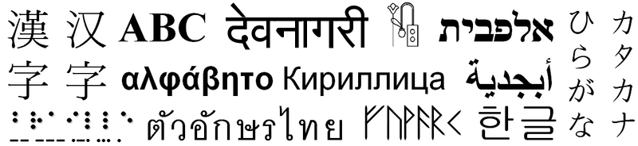

class: center, middle
# Något om Unicode

---
# Det började med bilder...

???
Skriftspråk, symboler för att representera skriftliga uttryck, har funnits länge.

---
# ASCII

- ASCII, American Standard Code for Information Interchange, arbetades fram under 60-talet

- Är en sju bitars encoding:
   - 0b0xxxxxxx

   - 27 = 128 möjliga värden: 0-127 decimalt, 0x0-0x7f hexadecimalt

Följande tecken kan uttryckas:

- 0123456789
- ABCDEFGHIJKLMNOPQRSTUVWXYZ
- abcdefghijklmnopqrstuvwxyz
- !"#$%&'()\*+,-./:;<=>?@
- [\\]^\_&#96;{|}~

Och flera "konstiga" tecken som inte är synliga, t.ex. ESC, TAB, WHITESPACE, DEL.

???
- Sju bitars encoding för att åttonde kan vara en paritetsbit.
- Summera bit:arna och kontrollera att de är jämn (eller udda).

---
# Hela ASCII tabellen

---
# Mer om ASCII??

TODO: Något om ctrl, bits, 4 column?

---
# 7 bitar räcker inte långt

- När åttonde biten blev tillgänglig fick det plats för mer

- Flera varianter som använda åttonde bit:en skapades

- *ISO 8859-1* (eller *latin1*) den vanligaste i västvärlden

  - Stödjer "västeuropeiska" språk till viss del

  - ÅÄÖ (och ØÑØÙß..) har värden definierade

- Räcker fortfarande inte långt internationellt
  - Och behov av tecken tillkommer - exempelvis €

???
- Varför "västeuropeiska"? Minoritetspråk fick t.ex. inte plats.

---
# En universell teckenkodning?

- Det vore trevligt att ha kunna uttrycka all världens tecken med en standard.

- Unicode, en idé om detta, arbetades fram i slutet på 80-talet.

- Joe Becker från Xerox skapade ett första dokument för Unicode.

Unicode is intended to address the need for a workable, reliable world text encoding. Unicode could be roughly described as "wide-body ASCII" that has been stretched to 16 bits to encompass the characters of all the world's living languages. In a properly engineered design, 16 bits per character are more than sufficient for this purpose.

- 16 bits räcker för all världens språk? 2^16 = 65536 möjligheter...

---
# Nja
