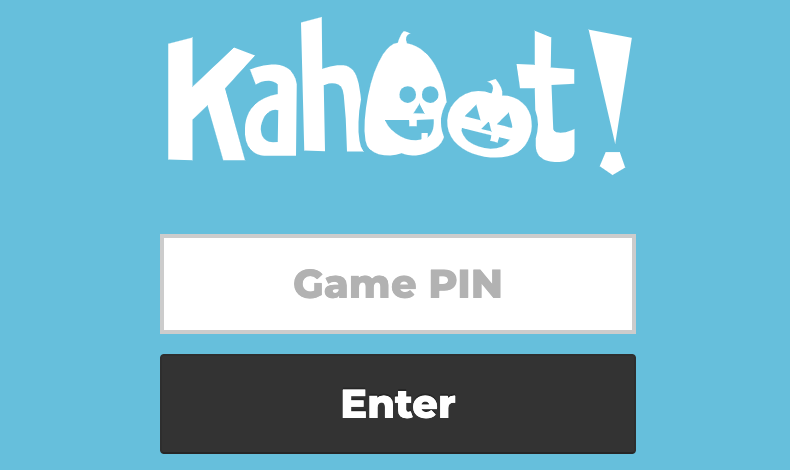

class: center, middle
# En djupdykning i Unicode

.center[]

https://fornwall.net/unicode-tapas

---
# Vad som ska besvaras

- Vad är Unicode och varför är det relevant?
- Hur kan historiken förklara nuvarande konstruktioner?
- Vad finns det för vanliga antaganden som inte fungerar över alla språk?

---
# ASCII: Sju bitar

- ASCII, American Standard Code for Information Interchange, arbetades fram under 60-talet

- Är en sju bitars encoding:
   - 0.red[xxxxxxx]

   - 2^27 = 128 möjliga värden: 0-127


---
# ASCII-tecken
Följande tecken kan uttryckas:

- 0123456789
- ABCDEFGHIJKLMNOPQRSTUVWXYZ
- abcdefghijklmnopqrstuvwxyz
- !"#$%&'()\*+,-./:;<=>?@
- [\\]^\_&#96;{|}~

Och flera "konstiga" tecken som inte är synliga, t.ex. ESC, BELL, BACKSPACE, DEL.

???
- Sju bitars encoding för att åttonde kan vara en paritetsbit.
- Summera bit:arna och kontrollera att de är jämn (eller udda).


---
# Hela ASCII tabellen


---
# 7 bitar räcker inte långt

- Vart är till exempel Å, Ä och Ö?
- När åttonde biten blev tillgänglig fick det plats för mer
- **Många** varianter som använde åttonde biten skapades
  - Olika mellan olika länder (och vissa länder hade flera)

---
# 8 bitars teckenkodning: ISO-8859-1

- .blue[ISO 8859-1] (eller .red[latin1]) den vanligaste i västvärlden

- ÅÄÖ (och ØÑÙß..) har värden definierade
  
- Stödjer ".green[västeuropeiska]" språk
  - Men inte alla, och inte fullt ut
  
- **Windows-1252**: Byter ut 30-tal kontrolltecken mot synliga bokstäver

???
- Windows-1252 alltså som iso-8859-1 men använder fler synliga bokstäver
  - Ofta mer praktiskt
  - vanligt att dokument som egentligen är windows-1252 **felaktigt påstår iso-8859-1**, att HTML5-specifikationen säger att dokument som påstår sig vara **iso-8859-1 ska avkodes som de vore windows-1252**
  
---
# 8 bitar räcker inte heller långt

- Räcker fortfarande inte långt internationellt

- Behov av tecken tillkommer även i västeuropa
  - €
  - 🤓
  

---
# En universell teckenkodning?

- Det vore önskvärt att kunna uttrycka .red[all världens tecken med en standard]

- .blue[Unicode], en idé om detta, arbetades fram i slutet på 80-talet

- Joe Becker från Xerox skapade en första draft för Unicode


---
# Unicode, ursprunglig draft

"Unicode is intended to address the need for a workable, reliable world text encoding.

Unicode could be roughly described as .green["wide-body ASCII" that has been stretched to 16 bits] to encompass the characters of all the world's .red[living languages].

In a properly engineered design, .blue[16 bits per character are more than sufficient for this purpose]."


---
# Identitet för bokstäver oavsett teckenkodning
- "Bokstäver" får en .blue[identitet oavsett byte-representation]

- Denna identitet identifieras av ett numeriskt värde, som A:=0x0041, B:=0x0042, ...

- En .blue[mer abstrakt nivå än teckenkodning], oberoende av byte-representation

???
- Påpeka vikten av att dela upp förståelsen av teckenkodning som en sak
- "Bokstäver" som annat
- Hjälper att dela upp ett stort komplext problem i två (iofs fortfarande stora, men iaf mindre...)

  
---
# Kodpunkter
- I Unicode kallas denna identitet för **kodpunkt** (en: **code point**)
  - Mer generellt än bokstav

- **.blue[U+0041]** används som syntax istället för **.red[0x0041]**

- Unicode definierar både egenskaper för kodpunkter, och teckenenkodningar för att representera dessa som bytes

???
- Vi vill slippa säga "bokstäver" i citat
- Syntaxen med U+ gör att det blir klart när vi pratar om det mer abstrakta begreppet kodpunkt, istället för byte-representationer


---
# UTF-16

- .red[Två bytes] per kodpunkt: A=.blue[0x0041], B=0x0042, ..., Ö=0x00D6, ..., ∞=0x221E
  - Kodpunkten för A=.blue[U+0041] är kompatibelt med ASCII, men inte byte-representationen (en byte .blue[0x41] i ASCII)
  
- Värdena kräver två bytes - vilken ordning? *Big-Endian* vs *Little-Endian*


---
# Big-endian
- Big-endian (eller .green[network byte order]): Mest signifikant byte först

  - .red[Som decimalsystem (12 = {1,2})]
  
  - .blue[∞=0x221E] blir representerat som byte-sekvensen .blue[{0x22, 0x1E}]

---
# Little-endian
- Little-endian: Minst signifikant byte först

  - .blue[∞=0x221E] blir representerat som byte-sekvensen .blue[{0x1E, 0x22}]

---
# UTF-16BE och UTF16LE
- **UTF-16BE** och **UTF-16LE** är namnet för teckenkodningar med big-endian och little-endian byte order

- .blue[Content-Type: text/html; charset=utf-16be]

- .red[Content-Type: text/html; charset=utf-16]
  - 🤔 Hur ska det här tolkas - big eller little endian?

???
- charset är case insentive här i http-headern (ofta lower case)
- Så här ska bara "utf-16" avläsas? (någon som har idé)?
- Någon som sätt en "feff" (F E FF) i början av t.ex. en xml-fil i en texteditor?

---
# Byte order mark (BOM)

- Kodpunkten U+.blue[FE].red[FF] är en byte order mark (BOM)

  - Placera den i början på fil. Vid inläsning, om de två första byte är {0x.blue[FE], 0x.red[FF]} är det BE, annars {0x.red[FF], 0x.blue[FE]} och därigenom LE

  - Det omkastade värdet U+.red[FF].blue[FE] är definierat att aldrig användas av text, så det inte dyker upp av misstag

---
# Byte order mark vs UTF-16BE och UTF-16LE

- .blue[Content-Type: text/html; charset=utf-16be]
- .red[Content-Type: text/html; charset=utf-16le]

- Om byte order är angiven explicit som ovan ska byte order mark **inte användas**

???
- Ska visa exempel på varför strax 
  
---
# Default endianess i UTF-16

- Om ingen BOM finns i början på input?

  - Enligt Unicode-standard är UTF-16.blue[BE] "default"
  
  - Och i java är UTF-16=UTF-16.blue[BE] om ingen BE detekteras
  
  - Men UTF-16.red[LE] är vanligare i praktiken och t.ex. WHATWG säger att tolka UTF-16 som UTF-16.red[LE]
  
---
# Character encoding i java
- En character encoding representeras av klassen [java.nio.charset.Charset](https://docs.oracle.com/en/java/javase/11/docs/api/java.base/java/nio/charset/Charset.html)

- För vanliga charsets finns Charset-instanser som fält i [StandardCharsets](https://docs.oracle.com/en/java/javase/11/docs/api/java.base/java/nio/charset/StandardCharsets.html)
  - StandardCharsets.US_ASCII
  - StandardCharsets.ISO_8859_1
  - StandardCharsets.UTF_16
  - StandardCharsets.UTF_16BE
  - StandardCharsets.UTF_16LE

???
- Låt oss gå in på java
---
# Icke-standard encoding i java
För icke-standard encodings kan `Charset.forName(String charsetName)` användas:

```java
try {
    Charset myCharset = Charset.forName("utf-16");
    doSomethingWithCharset(myCharset);
} catch (UnsupportedCharsetException e) {
    // Hantera UnsupportedCharsetException, ett checked exception.
}
```

```java
// För standard charsets (som UTF-8 ovan) är det dock onödigt,
// (från och med java 7), eftersom dessa charset alltid stöds:
doSomethingWithCharset(StandardCharsets.UTF_16);
```

---
# Detektera byte order med java
```java
// BOM=U+FEFF, A=U+0041
@Test
void detectByteOrder() throws IOException {
    var out = new ByteArrayOutputStream();
    out.writeBytes(new byte[]{(byte)0xFE, (byte)0xFF, 0x00, 0x41});

    var in = new InputStreamReader(new ByteArrayInputStream(
                                    out.toByteArray()),
                                    StandardCharsets.UTF_16);
    char c = (char) in.read();
    assertEquals('A', c);

    out = new ByteArrayOutputStream();
    out.writeBytes(new byte[]{(byte)0xFF, (byte)0xFE, 0x41, 0x00});

    in = new InputStreamReader(new ByteArrayInputStream(
                                out.toByteArray()),
                                StandardCharsets.UTF_16);
    c = (char) in.read();
    assertEquals('A', c);
}
```

???
- Notera att BOM inte läses till applikationen - 'A' är den första bokstaven


  
---
# Läsa UTF_16BE och UTF-16LE i java

```java
@Test
void specifiedOrderWithBom() throws IOException {
    var out = new ByteArrayOutputStream();
    out.writeBytes(new byte[]{(byte)0xFE, (byte)0xFF, 0x00, 0x41});
    var in = new InputStreamReader(new ByteArrayInputStream(
                                    out.toByteArray()),
                                    StandardCharsets.UTF_16BE);
    char c = (char) in.read();
    assertEquals(0xFEFF, c);
    c = (char) in.read();
    assertEquals('A', c);

    out = new ByteArrayOutputStream();
    out.writeBytes(new byte[]{(byte)0xFF, (byte)0xFE, 0x41, 0x00});
    in = new InputStreamReader(new ByteArrayInputStream(
                                out.toByteArray()),
                                StandardCharsets.UTF_16LE);
    c = (char) in.read();
    assertEquals(0xFEFF, c);
    c = (char) in.read();
    assertEquals('A', c);
}
```

???
- Understryk ordningen av byte array.
- Byte Order Mark erhålls som första bokstav pga av byte order angivits explicit i BE och LE


---
# När byte order inte anges?
```java
@Test
void defaultUtf16() throws IOException {
    // A=U+0041
    var out = new ByteArrayOutputStream();
    out.writeBytes(new byte[]{0x00, 0x41});

    var in = new InputStreamReader(new ByteArrayInputStream(
                                    out.toByteArray()),
                                    StandardCharsets.UTF_16);
    char c = (char) in.read();
    assertEquals('A', c);

    out = new ByteArrayOutputStream();
    out.writeBytes(new byte[]{0x41, 0x00});

    in = new InputStreamReader(new ByteArrayInputStream(
                                out.toByteArray()),
                                StandardCharsets.UTF_16);
    c = (char) in.read();
    // 䄀=U+4100
    assertEquals('䄀', c);
}
```

???
- Observera att "A" läses in fel.
- Java default:ar UTF-16 som UTF-16BE.


---
# 16 bitar räcker inte

- Räcker inte för historiska skriftspråk

- Räcker inte för alla möjliga emojis och varianter på dessa

- UTF-16 tillåter .red[fler genom att kombinera speciella 16-bitars värden]


---
# Surrogatkodpunkter
- Vissa kodpunkter som ännu inte allokerats definieras att de ska kombineras för att utöka namnrymnden:
  - Om första värdet är en .blue[high surrogate]
  - så kombineras den med en följande .red[low surrogate]

  
---
# Surrogatkodpunkter: Hur kombinera?

.blue[Låg surrogat] = 110110.blue[yyyyyyyyyy]

.red[Hög surrogat] = 110111.red[xxxxxxxxxx]

Kodpunkt = .blue[yyyyyyyyyy].red[xxxxxxxxxx]

- Innebär att låga surrogat är i intervallet .blue[{U+D800, U+DBFF}], höga i intervallet .red[{U+DC00, U+DFFF}]
  - Varje intervall har 2^10=1024 värden
  
???
- Låga surrogat-kodpunkter definieras av bit-prefixet 110110 (visa genom att peka)
- Och höga med ett annat (peka)
- Kombineras till


---
# Unicodes namnrymd
- Totalt möjliga värden:
  - 2^16 + 1024\*1024 = 1,114,112

- Unicode kommer inte definiera kodpunkter utanför den mängden
  
- 836,536 lediga tecken (**Reserverade**, dvs tillgängliga för användning men ännu inte definierade) i senaste Unicode 12.1

???
- Finns alltså gott om utrymme, Unicode har utlovat i en stabilitetspolicy att aldrig definiera mer än så här många tecken

---
# Java och UTF-16
- En **char** är 16 bitar - en .red[kodenhet] i UTF-16

- `String.length()` returnerar antal UTF-16 värden, inte antal kodpunkter

- Kodpunkter som kräver två 16 bitars är ofta ovanliga
  - Många system hanterar inte detta korrekt
  
???
- En **kodenhet** är alltså enheten (atomen) i encodingen
- En **kodpunkt** är något mer abstrakt.
  - För vanliga tecken är det ett till ett mellan kodenhet och kodpunkt
  - Meeen: För surrogat-kodpunkter
- Pausa och understryk
  
---
# Unicode literals i java

Via syntaxen '.red[\u].blue[XXXX]', dvs .red[\u] följt av fyra hexadecimala siffror, så kan 16-bitars kodpunkter uttryckas.

```java
@Test
void literals() {
    assertEquals(0x41, '\u0041');
    assertEquals('A', '\u0041');
    // U+1F600 (GRINNING FACE) kräver ett surrogatpar:
    assertEquals("😀", "\uD83D\uDE00");
}
```

???
- Observera att GRINNING FACE kräver två java characters, ett surrogatpar
  
---
# Java-sträng från bytes och till bytes
- `new String(byte[] bytes, Charset charset)`

- `byte[] String.getBytes(Charset charset)`
  
- Vid större datamängder bör strömmar användas för att kontinuerligt tolka/koda allteftersom data blir tillgänligt

???
- Poängtera: Har du en byte-array har du inte en sträng. En sträng är kombinationen av byte-array och en encoding
- Omvänt: Har du en sträng har du inte en byte-array. En byte-array är en kombination av sträng och en encoding

---
# Hantering av surrogatkodpunkter i java


```java
// java.lang.Character har flera relevanta hjälpmetoder:
var string = "...";
for (int i = 0; i < string.length(); i++) {
    char c1 = string.charAt(i);

    int codePoint;
    if (Character.isHighSurrogate(c1)) {
        i++;
        char c2 = string.charAt(i);
        if (Character.isLowSurrogate(c2)) {
            codePoint = Character.toCodePoint(c1, c2);
        } else{
            throw new IllegalArgumentException("What?");
        }
    } else {
        codePoint = c1;
    }
    // Do something with code point.
}
```


---
# String.codePoints()

- `String.codePoints()` returnerar en `IntStream`

```java
String s = "...";
s.codePoints().forEach(codePoint -> {
    // Do something with code point.
});
```


---
# Vad händer om vi bryter mitt i?

- "Skriv ut de tre första bokstäverna i namnet?"

- 🙃=U+1F643, "UPSIDE-DOWN FACE", kräver surrogatkodpunkter.

```java
public static void main(String[] args) {
    String name = "🙃🙃";
    String start = name.substring(0, 3);
    System.out.println(start);
}
```

🙃?

???
- Se nästa slide  

---
# Felhantering i UTF-16
- Skriver ut en 🙃=.blue[U+1F643], följt av ?=.red[U+003F]

- Detta är betendet på `PrintStream`-instansen i `System.out` - det finns API:er för att hantera fel på andra sätt

- Fel här kan vara en hög surrogatkodpunkt som inte följs av låg, eller låg som inte föregås av hög.

---
# UCS-2
- UCS-2 är en gammal teckenenkoding som i princip är UTF-16 utan surrogatpar

???
- Bra att känna till (men används inte)
- Nu lämnar vi 16 bitars enkodning bakom oss!

---
# UTF-32 (eller UCS-4)

- Varför inte bara encode:a ut varje kodpunkt som ett 32-bitars värde?

- UTF-32 - enkelt, men används väldigt lite i praktiken

- Endian-problemet återkommer, så UTF-32BE och UTF-32LE precis som med 16-bitars teckenkodning

???
- Obs att antal kodpunkter fortfarande är begränsat till de som kan uttryckas i Unicode, så 1,114,112 totalt (32 bitar utnyttjas inte fullt ut)
- UCS-4 är samma sak som UTF-32

---
# UTF-24?

- Max antal kodpunkter (1,114,112), ryms i .red[21 bitar]

- Fanns förslag om UTF-24 men accepterades aldrig

???
- Nu paus, sen går vi igenom UTF-8, den vanligaste och mest praktiskt användbara teckenkodningen

---
# UTF-8

- UTF-16 är 16-bitars enheter där .blue[**två enheter vid behov kan kombineras**] till kodpunkter

- UTF-8 är 8-bitars enheter där .red[**upp till fyra enheter vid behov kan kombineras**] till kodpunkter
  - Vanligaste teckenkodningen på internet, "den du ska använda"


---
# Varför UTF-8 istället för UTF-16?

- .red[Bakåtkompatibilitet med ASCII], i det att ASCII är ett subset av UTF-8
  - Alla ASCII-filer är giltiga UTF-8 filer

- .blue[Mindre utrymme i minne och lagring] - om största delen av texten är ASCII (vilket ofta är fallet), dubblerar UTF-16 minnesanvändning (= ger sämre prestanda)


---
# UTF-8, hur ser det ut?
- Bakåtkompatibilitet med ASCII, så upp till sju bitar representeras på samma sätt: 0.red[xxxxxxx]

- 110.blue[xxxxx] + 10.blue[xxxxxx]

- 1110.blue[xxxx] + 10.blue[xxxxxx] + 10.blue[xxxxxx]

- 11110.blue[xxx] + 10.blue[xxxxxx] + 10.blue[xxxxxx] + 10.blue[xxxxxx]

---
# Inledande och continuation bytes
- .blue[110]xxxxx + .red[10]xxxxxx

- .blue[1110]xxxx + .red[10]xxxxxx + .red[10]xxxxxx

- .blue[11110]xxx + .red[10]xxxxxx + .red[10]xxxxxx + .red[10]xxxxxx

- En .blue[inledande byte] (.blue[110]xxxxx/.blue[1110]xxxx/.blue[11110]xxx) som följs av .red[continuation bytes] (.red[10]xxxxxx)

---
# Maxvärde upp till 21 bitar

- .blue[11110].green[xxx] + .red[10].green[xxxxxx] + .red[10].green[xxxxxx] + .red[10].green[xxxxxx]

- Är .green[21 bitar], vilket är tillräckligt för att täcka Unicodes namnrymd på 1,114,112 värden


---
# UTF-8 är självsynkroniserande
- Hoppas det in mitt i en UTF-8 ström kommer inte en felaktigt värde avläsas

- Istället kan eventuella .red[continuation bytes] (.red[10]xxxxxx) skippas (max 3 st) innan strömmen kan börja avläsas igen

---
# UTF-8: Overlong encodings
- 0.blue[xxxxxxx] för sju bitar
- 110.red[xxxx].blue[x] + 10.blue[xxxxxx] för 8 till 11 bitar

- Om rödmarkerade bitar sätts till 0 så kan ASCII-tecken representeras på två sätt
  - Och liknande för längre sekvenser
  - Tillåts inte: mappning kodpunkt <-> serialisering i UTF-8 ett till ett, minimal längd på enkodning måste användas
  
---
# UTF-8: Byte-sekvens för kodpunkt är unik i byte-ström
- En egenskap i UTF-8 (mha konstruktionen med initial och continuation byte) är att byte-sekvensen för en kodpunkt är unik
  - Dvs, återfinns aldrig som som delmängd av något annat, eller överlappandes mellan olika kodpunkter
  - För att räkna t.ex. antal 'A' räcker det att räkna antalet gånger byte-värdet 0x41 hittas

---
# UTF-8: För stora värden
- 11110.green[xxx] + 10.green[xxxxxx] + 10.green[xxxxxx] + 10.green[xxxxxx]

- .green[21 bits] räcker för Unicodes namnrymd på 1,114,112 - men kan också uttrycka större värden (.red[2,097,151])

- Om värdet är för stort är det .red[ogiltig UTF-8]


---
# Möjliga fel vid deserialisering
- Overlong encoding
- För stora värden
- Surrogatkodpunkter (får inte förekomma som kodpunkter i UTF-8)
- Oväntad continuation byte
- En leading byte när en continuation byte förväntas
- En sträng som avslutas innan alla continuation bytes erhållits

---
# Felhantering
- **UTF-8 decoder**: Transformerar en .blue[ström av bytes] till en .blue[ström av kodpunkter]
  - .blue[{0x23, 0x42, 0xA1, ... }]
  - ->
  - .red[{U+0041, U+AF0F, U+0110, .... }]

- Tidiga UTF-8 decoders hade ofta inkonsekvent felhantering - olika program tolkade ogiltiga UTF-8 sekvenser olika

---
# Fel är oacceptabelt
- Unicode definierar att en decoder måste hantera ogiltiga byte-sekvenser som fel

  - Får .red[inte] acceptera ogiltigt input och .red[gissa] vad som avses
  - Får .red[inte] ge ifrån sig .red[ogiltiga kodpunkter] (surrogat, för höga värden)
  - .blue[Hantera som fel] kan betyda olika saker
  
???
- Jämför med HTML5-specifikationen, som också vill att fel ska hanteras lika

---
# Felhantering: Kasta exception eller avbryt inläsning

- En decoder kan kasta exception eller avbryta inläsning
  - Kan leda till denial of service eller säkerhetshål om oväntat

- Används inte av javas standardbibliotek

---
# Felhantering: Byt ut fel mot ersättningsbokstav
- Byt ut fel mot ersättningsbokstav

- Ofta ?=U+003F (QUESTION MARK*) eller �=U+FFFD (REPLACEMENT CHARACTER)
  
```java
@Test
void iso88591ReadAsUtf8() {
    byte[] b = new byte[]{'f', (byte) 0xF6, 'r' };
    String s = new String(b, StandardCharsets.UTF_8);
    assertEquals("f\uFFFDr", s);
}
```

???
- Vi har gått igenom encodings nu - paus innan vi tar oss an Unicode och egenskaper

---
# Unicode som databas
- Unicode kan ses som en .red[versionerad databas] som definierar egenskaper för kodpunkter
  - En rad med kodpunktens värde (**U+xxxx**) som primary key och ett .red[flertal fält]
  - Och .blue[beteenden samt algoritmer] på hur denna data ska behandlas
  
---
# Namn på kodpunkter
- .blue[Namn] är en egenskap i Unicode-databasen (ett fält på en kodpunkt):
  - .red[U+0041] (A) har namnet ".blue[LATIN CAPITAL LETTER A]"
  - .red[U+1F4A9] (💩) har namnet ".blue[PILE OF POO]"
  
???
- "Den här lilla bajsplutten" kanske är bra namn
  
---
# Namn av code point i java
- .red[Javas standardbibliotek innehåller delar av Unicodes databas], bland annat namn

- `Character.getName(int codePoint)` kan t.ex. användas för att erhålla namnet för en kodpunkt:

```java
@Test
void codePointName() {
    var codePoint = 0x0041; // A
    assertEquals("LATIN CAPITAL LETTER A",
        Character.getName(codePoint));
    codePoint = 0x1F4A9; // 💩
    assertEquals("PILE OF POO", Character.getName(codePoint));
}
```

---
# Unicode och bakåtkompatibiltet

- Finns olika **Unicode Stability Policies** på vad som kan och inte kan ändras
- .blue[Bakåtkompatibel] - kodpunkter kan läggas till och deprekeras, men inte tas bort, och många fält kommer aldrig ändras

- Namn ändras inte: `U+FE18` kommer alltid heta PRESENTATION FORM FOR VERTICAL RIGHT WHITE LENTICULAR .red[BRAKCET]


---
# Java versioner och Unicode versioner
```
Java version   Release date         Unicode version
------------   ------------         ---------------
Java 13        September 2019       Unicode 12.1
Java 12        March 2019           Unicode 11.0
Java 11        March 2018           Unicode 10.0
Java 10        September 2018       Unicode 8.0
Java 9         September 2017       Unicode 8.0
Java 8         March 2014           Unicode 6.2
Java SE 7      July 28, 2011        Unicode 6.0
Java SE 6      December 11, 2006    Unicode 4.0
J2SE 5.0       September 30, 2004   Unicode 4.0
J2SE 1.4       February 6, 2002     Unicode 3.0
J2SE 1.3       May 8, 2000          Unicode 2.1
J2SE 1.2       December 8, 1998     Unicode 2.1
JDK 1.1        February 19, 1997    Unicode 2.0
JDK 1.1.7      September 12, 1997   Unicode 2.1
JDK 1.1        February 19, 1997    Unicode 2.0
JDK 1.0        January 23, 1996     Unicode 1.1.5
```

???
- Testet på förra sliden, där vi tog ut namnet på en bajsplutt, fungerar inte på hur gamla java-versioner som helst

---
# General category
Varje kodpunkt har i Unicode-databasen ett [General Category](https://en.wikipedia.org/wiki/Unicode_character_property#General_Category)-fält.

Berätter vilken typ av bokstav det är.

```java
@Test
void generalCategory() {
    assertEquals(Character.CONNECTOR_PUNCTUATION,
        Character.getType('_'));
    assertEquals(Character.MATH_SYMBOL,
        Character.getType('='));
    assertEquals(Character.SURROGATE,
        Character.getType(0xD800));
}
```

???
- Följ General Category-länken till
- I java kan vi erhålla detta via metoden Character.getType())

---
# Private use characters
- Det finns totalt 137,468 kodpunkter som har kategorin **private use**

- "Private-use characters are code points whose interpretation is not specified by a character encoding standard and whose use and interpretation may be determined by private agreement among cooperating users"

???
- Om du vill definiera kodpunkter från alviska kan du ta en range härifrån och säga att detta bör användas bland Tolkien-entusiaster
  - Just detta är t.ex. redan gjort (och klingong)

---
# Private use exempel: Apple logotyp
- Apple ville/kunde inte gå igenom en standardiseringsprocess för att få en kodpunkt för dess logotyp

- Definierade  U+F8FF som deras logotyp

```java
@Test
void generalCategory() {
    assertEquals(Character.PRIVATE_USE, Character.getType(''));
}
```

???
- Stöds på Mac och iOS eftersom det är Apples platform - behöver inte stödjas på andra plattformar

---
# Unicode plan

- Kodpunkterna är uppdelade i 17 plan, där varje plan har 65 536 (2^16) kodpunkter
  - Sista planet kan inte användas fullt ut pga 21-bitars begränsningen

- **Plane 0** heter **Basic Multilingual Plane (BMP)**
  - https://en.wikipedia.org/wiki/UTF-16#/media/File:Unifont_Full_Map.png
  
???
- Följ länken och gå igenom med start av ASCII högst upp
- Varje rad är 256 tecken lång
- Observera 8 (pga 1024+1024 = 8*256) gråa rader för surrogate characters
- Efter detta många vita rader för private use characters

---
# Fler plan
- Plan 1: Supplementary Multilingual Plane (SMP)
- Plan 2: Supplementary Ideographic Plane (SIP)
- Plan 3 till 13: Ej tilldelade
- Plan 14: Supplementary Special-purpose Plane (SSP)
- Plan 15 och 16: Private use planes

---
# Noncharacters
- Det finns 66 kodpunkter som kallas **noncharacters** (icke-bokstäver)
- Ska inte dyka upp i text som utbyts mellan system
- Ett intervall av 32 noncharacters i BMP (U+FDD0..U+FDEF)
- Sista två kodpunkterna i varje plan: .red[U+FFFE], U+FFFF, U+1FFFE, U+1FFFF, U+2FFFE, U+2FFFF, ... U+10FFFE, U+10FFFF

???
- Lägg märke till FFFE i rött, vilken är den andra byte-ordningen på BOM (byte order marker) i UTF-16, vilken alltså inte ska dyka upp


---
# Combining characters
- En combining character modifierar andra bokstäver, som när `U+0306 (COMBINING BREVE)` nedan modifierar `U+0079 (LATIN SMALL LETTER Y)`.

.center[]

---
# Combining characters: Emoji modifier
Ett annat exempel på modifiers är de som anger hudfärg på emojis, som `U+1F3FE (EMOJI MODIFIER FITZPATRICK TYPE-5)` nedan:


.center[]

---
# Combining characters: Multiple

Flera modifiers kan förekomma, nedan med `U+0065 (LATIN SMALL LETTER E)` och `U+0304 (COMBINING MACRON)` som exempel:

## ē // U+0065, U+0304

## ē̄ // U+0065, U+0304, U+0304

## ē̄̄ // U+0065, U+0304, U+0304, U+0304

---
# Olika typer av kombinerande kodpunkter

Med hjälp av `Character.getType(codePoint)` kan vi se erhålla Unicode kategoring och se vilken typ av kombinerande kodpunkt det rör sig om.

---
# Olika typer av kombinerande kodpunkter

- Character.**NON_SPACING_MARK**: Märken såsom cirkel&prickar i ÅÄÖ som går ovanför eller under utan att påverka vidden.

- Character.**ENCLOSING_MARK**: Ett omgivande märke som en cirkel.

- Character.**COMBINING_SPACING_MARK**: En markering som påverkar vidden på det den kombineras med.


---
# Bokstäver som kan uttryckes både med och utan modifier
Ekvivalens mellan .blue[precomposed character] och .red[combining character].
Bokstaven **Å** kan uttryckas som

- Kodpunkten .blue[U+00C5 (LATIN CAPITAL LETTER A WITH RING ABOVE)]
- Kodpunkten .red[U+0041 (LATIN CAPITAL LETTER A)] följt av .red[U+030A (COMBINING RING ABOVE)]
  - A +         	̊ = Å

---
# Ekvivalens pga character duplication
Förutom att skrivas med modifying character, så kan **Å** skrivas med en annan kodpunkt:

- Kodpunkten `U+212B (ANGSTROM SIGN)`

Dessa är att anse som .blue[ekvivalenta].

---
# Unicode canonical equivalence
Det finns alltså (åtminstone) tre sätt att uttrycka Å. Oavsett kodpunkter är dessa definierade som *kanoniskt ekvivalenta*, vilket innebär:

- Ser samma ut när de skrivs ut och visas grafiskt
- Kan bytas ut mot varandra utan att ändra innebörd för användaren
- Ska därför t.ex. sorteras likadant och sökas efter likadant

---
# Unicode compatible equivalence
Förutom den starka kanoniska ekvivalensen finns det en svagare *kompatibel ekvivalens*:

- Kan ha olika utseenden, men har samma mening i vissa (men inte alla) kontexter
- Kan bytas ut mot varandra i vissa kontexter, inte alltid
- Exempel: ff (`U+FB00, LATIN SMALL LIGATURE FF`) är kompatibel med ff (två "f"-tecken i följd, U+0066 U+0066)

---
# Unicode normalization
- Unicode definierar hur en text kan normaliseras, vilket innebär att två texter som är ekvivalenta normaliseras till samma text.
  - `normalize(s1) == normalize(s2)` omm s1 och s2 är ekvivalenten

---
# Unicode normalization
- Detta görs antingen genom att sätta samman kodpunkter så långt det går (**fully composed**)
- ... eller genom att splittra upp kodpunkter så långt det går (**fully decomposed**)

- Det kan göras via kanonisk ekvivalens
- ... eller kompatibel ekvivalens

Dvs, fyra möjligheter.

---
# Normal form: NFD
**NFD**: Normalization Form Canonical Decomposition

Characters are **decomposed** by canonical equivalence, and multiple combining characters are arranged in a **specific order**.

---
# NFD: Specifik ordning viktig
Här är specifik ordning viktig, så att

- "a modifierad med prick ovanför modifierad med prick nedanför"

normaliseras till samma form som

- "a modifierad med prick nedanför modifierad med prick ovanför"

---
# Normal form: NFC
**NFC**: Normalization Form Canonical Composition

Characters are decomposed and then recomposed by canonical equivalence.

---
# De fyra normalformerna
- NF**.green[K].red[D]** (Normalization Form **.green[Compatibility] .red[Decomposition]**)
- NF**.green[K].blue[C]** (Normalization Form **.green[Compatibility] .blue[Composition]**)
- NF**.red[D]** (Normalization Form Canonical **.red[Decomposition]**)
- NF**.blue[C]** (Normalization Form Canonical **.blue[Composition]**)

---
# Hur kan Unicode normalisering användas
- Önskvärd funktionalitet: Ekvivalenta söktermer ska ge ekvivalenta sökresultat

- Säkerhetsaspekt: En användare som heter "Åsa" missköter sig och stängs av - men var det rätt användare?

- Normalisera alltid användar input innan någon operation utförs (data sparas eller söks efter)

---
# HFS, APFS och Unicode normalisering
"iOS HFS Normalized UNICODE names, APFS now treats all files as a bag of bytes on iOS. We are requesting that Applications developers call the correct Normalization routines to make sure the file name contains the correct representation."

- Ibland en bra approach: Data är "bag of bytes" utan komplicerad tolkning i många lager

???
- HFS var gamla filsystemet på Mac och iOS, som hade normalisering inbyggt
- Det är undantag bland filsystem att agera så, och nya filsystemet som ersatte detta gör inte inbyggd Unicode normalisation

---
# Unicode normalization: Kodexempel i java

```java
@Test
void normalization() {
    // U+00C5 (LATIN CAPITAL LETTER A WITH RING ABOVE)
    String s1 = "\u00C5"; 
    // U+0041 (LATIN CAPITAL LETTER A)
    // U+030A (COMBINING RING ABOVE)
    String s2 = "\u0041\u030A";
    // U+212B (ANGSTROM SIGN)
    String s3 = "\u212B";

    String n1 = Normalizer.normalize(s1, Form.NFD);
    String n2 = Normalizer.normalize(s2, Form.NFD);
    String n3 = Normalizer.normalize(s3, Form.NFD);

    assertEquals(n1, "\u0041\u030A");
    assertEquals(n1, n2);
    assertEquals(n2, n3);

    assertEquals("\u00C5",
    	Normalizer.normalize("\u0041\u030A", Form.NFC));
}
```

---
# Bokstäver kan vara olika breda
- `U+FDFD (ARABIC LIGATURE BISMILLAH AR-RAHMAN AR-RAHEEM)` är en kodpunkt som ser ut så här:
﷽

- Och tecken som har ingen bredd, tecken som kombinerar med föregående för att ändra bredd osv

- `String.length()` inte alltid bra approximation på visuell bredd av sträng

???
- Kom ihåg: `String.length()` returnerar antal UTF-16 kodenheter


---
# Gemener och versaler: Skillnader i antal kodpunkter
- Javas `String.toUpperCase()` och `String.toLowerCase()` hanterar komplexiteten i gemener&versaler

- Längden på strängen kan ändras av detta, exempelvis blir .red[ß U+00DF LATIN SMALL LETTER SHARP S] till en sekvens av två .blue[S U+0053 LATIN CAPITAL LETTER S]


---
# Gemener och versaler: Skillnad mellan språk
- .red[String.toUpperCase()] default:ar till systemets Locale
- Men att gå mellan gemener och versaler är språkberoende, därför: .blue[String.toUpperCase(locale)]

- Exempel: För turkiska blir .red[i U+0069 (LATIN SMALL LETTER I)] som versal .blue[İ U+0130 LATIN CAPITAL LETTER I WITH DOT ABOVE]

???
- Samma då med `String.toLowerCase()`

---
# Gemener och versaler: Exempel i java
```java
@Test
void upperCase() {
    // I: U+0049 (LATIN CAPITAL LETTER I)
    assertEquals("\u0049", "i".toUpperCase(Locale.ENGLISH));

    // İ U+0130 (LATIN CAPITAL LETTER I WITH DOT ABOVE)
    assertEquals("\u0130", "i".toUpperCase(
        Locale.forLanguageTag("tr")));

    assertEquals("SS", "ß".toUpperCase(Locale.ENGLISH));
}
```

---
# Sortering är språk-beroende

```java
@Test
void lithuanian() {
  var collator = Collator.getInstance(Locale.forLanguageTag("lt"));
  var list = Arrays.asList("i", "k", "y");
  list.sort(collator);
  Assertions.assertEquals(List.of("i", "y", "k"), list);
}

@Test
void german() {
  var collator = Collator.getInstance(Locale.forLanguageTag("de"));
  var list = Arrays.asList("a", "b", "ä");
  list.sort(collator);
  Assertions.assertEquals(List.of("a", "ä", "b"), list);
}
```

???
- Sortering (i den betydelsen hur användare normalt förväntar sig sorterade, listor av strängar att visas), är språkberoende
- Unicode definierar hur strängar kan sorteras i olika språk
- Finns stöd för detta i javas standardbibliotek: java.text.Collator (highlight:a i koden)
- För t.ex. lituaiska sorteras y mellan i och k
- För t.ex. tyska sorteras ä strax efter a


---
# Grapheme cluster
- Ett **grapheme cluster** är ungefär en **användarupplevd bokstav**
  - En eller flera kodpunkter
  - T.ex. [👩‍👩‍👧‍👦 (sju kodpunkter)](https://r12a.github.io/uniview/?charlist=👩‍👩‍👧‍👦) är ett grapheme cluster
  - En text selection i ett GUI kommer normalt aldrig sluta mitt i ett grafem kluster
  - Önskningen ".red[ta bort sista bokstaven]" motsvarar ofta att .blue[ta bort sista grafem klustret]

???
- Klicka på länken - poängtera **Uniview** som trevligt web-baserat gränssnitt


---
# ICU project

- http://site.icu-project.org/home

- "ICU is a mature, widely used set of C/C++ and Java libraries providing Unicode and Globalization support for software"

- Om en Unicode-funktionalitet saknas i javas standardbibliotek finns det antagligen i ICU

- Innehåller bland annat stöd för grapheme clusters


---
# Creative usernames and Spotify account hijacking

https://labs.spotify.com/2013/06/18/creative-usernames/

???
- Dragspel - skippa om ont om tid, quiz kommer ta några minuter


---
# Twitter, emojis och jämlikhet

- [💁](https://r12a.github.io/uniview/?charlist=💁) Emoji: 2

- [💁🏽](https://r12a.github.io/uniview/?charlist=💁🏽) Emoji + skin tone: 4

- [💁‍♂](https://r12a.github.io/uniview/?charlist=💁‍♂) Emoji + gender: 7

- [💁🏽‍♂](https://r12a.github.io/uniview/?charlist=💁🏽‍♂) Emoji + gender + skin tone: 9

- [🇳🇴](https://r12a.github.io/uniview/?charlist=🇳🇴) Country Flag: 4

- [🏳‍🌈](https://r12a.github.io/uniview/?charlist=🏳‍🌈) Rainbow Flag: 7


???
- Dragspel - skippa om ont om tid, quiz kommer ta några minuter
- Förut räknade twitter emojis med modifieras som olika längd vad gäller deras max-begränsning i längd
- Från och med oktober 2018 räknas varje emoji som två bokstäver

---
# Quiz-dags!

- Gå till **kahoot.it** på era telefoner



???
- Fråga om alla som vill är redo och stå på sidan
- Gå till kahoot.com och starta, kom ihåg **namngenerering** och **individuell**
